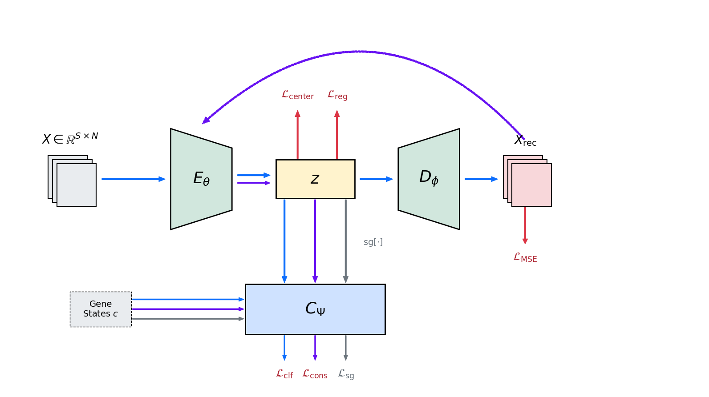
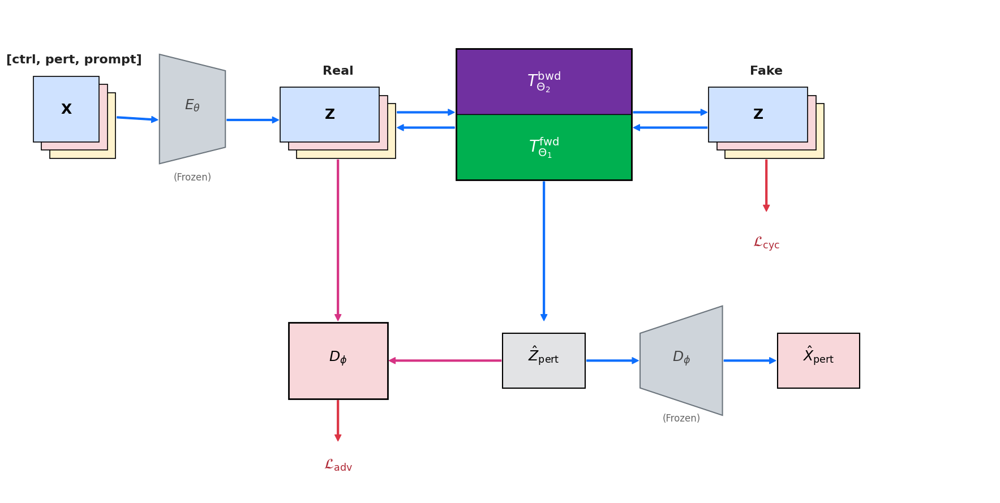

## Method

*Figure 1: Training pipeline of the regularized autoencoder.*

### Phase One: Regularized Latent Autoencoder

Our approach follows the general paradigm of latent diffusion models [rombach2022high], in which high-dimensional observations are first mapped into a lower-dimensional latent space via an autoencoder.

Given the high dimensionality of gene expression profiles, processing the full vector with standard linear layers is computationally heavy. To address this, we tokenize the input vector into a sequence of lower-dimensional segments. These segments are then processed by a Transformer encoder [vaswani2017attention], utilizing bidirectional self-attention [DBLP:journals/corr/abs-1810-04805] to capture complex, non-local gene dependencies.

Let $X \in \mathbb{R}^d$ denote a gene expression vector. An encoder $E_{\theta}$ projects $X$ into a latent representation $z$, which is subsequently reconstructed as $X_{\mathrm{rec}}$ by a decoder $D_{\phi}$:

$$X_{\mathrm{rec}}=D_{\phi}(E_{\theta}(X))$$

A standard autoencoder does not explicitly enforce preservation of biologically meaningful class information, such as the cellular state. To be able to study perturbation effects in the latent space, we augment the model with a latent classifier $C_{\Psi}$ that predicts the cell state directly from the latent representation, i.e., $\hat{c}_i=C_{\Psi}(z_i)$. We decided not to place it in the reconstruction space due to the high dimensionality of virtual cell modeling. In virtual cell analysis this cell state can be for example the cell cycle state, a population where the specific cell is originated, is it in stressed state.

#### Latent Space Regularization.
The classifier is trained using a stop-gradient operation on the encoder output, preventing its updates from affecting the encoder:

$$\mathcal{L}_{\mathrm{sg}}=\mathrm{CE}\bigl(C_{\Psi}(\mathrm{sg}[E_{\theta}(X)]),c\bigr)$$

where $\mathrm{sg}[\cdot]$ denotes the stop-gradient operator. This loss is used exclusively for the classifier's training step.

Training a vanilla autoencoder typically results in an unregularized latent space that is unsuitable for downstream perturbation modeling [kingma2013auto]. 
To address this, we introduce a *center loss* ($\mathcal{L}_{\mathrm{CE}}$) [wen2016discriminative] that encourages latent representations of the same biological state (e.g., control or perturbed) to form compact and well-separated clusters. 
We further employ an auxiliary regularization term ($\mathcal{L}_{\mathrm{reg}}$) [regularization] to mitigate gradient instability during training. 

To additionally regularize the encoder, we include a second classification term without the stop-gradient:

$$\mathcal{L}_{\mathrm{CLF}}=\mathrm{CE}\bigl(C_{\Psi}(E_{\theta}(X)),c\bigr)$$

This term encourages the encoder to produce latents that are themselves predictive of the cell state, while the classifier receives gradients from both terms (which only improves its accuracy and does not harm training dynamics).

The full autoencoder objective is then:

$$\mathcal{L}_{\mathrm{AE}}=\lambda_{\mathrm{MSE}}\mathcal{L}_{\mathrm{MSE}}+\lambda_{\mathrm{CE}}\mathcal{L}_{\mathrm{CE}}+\lambda_{\mathrm{reg}}\mathcal{L}_{\mathrm{reg}}+\lambda_{\mathrm{CLF}}\mathcal{L}_{\mathrm{CLF}}$$

where $\mathcal{L}_{\mathrm{MSE}}$ is the reconstruction loss, $\mathcal{L}_{\mathrm{CE}}$ the center loss, $\mathcal{L}_{\mathrm{reg}}$ combines auxiliary regularization terms, and the $\lambda$ coefficients are scalar hyperparameters.

#### Latent Consistency.
To ensure training stability [GAN_inst1, GAN_inst2] and a self consistent encoder and decoder we applied consistency monitoring. A latent sample $z_i$ is decoded and re-encoded as $z_{\mathrm{rec}}=E_{\theta}(D_{\phi}(z_i))$, and both representations are required to produce consistent class predictions:

$$\mathcal{L}_{\mathrm{cons}}=\mathrm{CE}\bigl(C_{\Psi}(z_i),C_{\Psi}(z_{\mathrm{rec}})\bigr)$$

where $\mathrm{CE}(\cdot)$ denotes the cross-entropy loss. The training is stopped if this error starts to constantly increase.

### Second Phase: Latent Transition Modeling

*Figure 2: Training pipeline of the second phase of training.*

Due to the absence of paired control–perturbation samples, a supervised latent transition model cannot be trained directly. We therefore adopt a *latent cycle GAN* framework [zhu2017unpaired, latent_cycle_gan] that learns bidirectional mappings between control latent distributions $Z_{\mathrm{ctrl}}$ and perturbed latent distributions $Z_{\mathrm{pert}}$. 

A *forward transition block* $T^{\mathrm{fwd}}_{\Theta_1}$ maps control latents to perturbed latents, while a *backward transition block* $T^{\mathrm{bwd}}_{\Theta_2}$ performs the inverse mapping: 

$$Z_{\mathrm{pert}}=T^{\mathrm{fwd}}_{\Theta_1}(Z_{\mathrm{ctrl}}), \qquad Z_{\mathrm{ctrl}}=T^{\mathrm{bwd}}_{\Theta_2}(Z_{\mathrm{pert}})$$

Since the true inverse of a biological perturbation is unknown, the backward transition model is tasked with learning an implicit inversion corresponding to the perturbation that generated the observed perturbed state. Converting perturbed state to control state has no biological meaning, it was just a proxy task to increase the quality of our data generation.
To ensure consistency between these transformations, we apply a *cycle-consistency loss* $\mathcal{L}_{\mathrm{cycle}}$ that enforces the reconstruction of latent vectors after forward–backward and backward–forward passes. This loss utilizes MSE to minimize the distance between the original latents and their cycled counterparts:

$$\mathcal{L}_{\mathrm{cycle}}=\mathrm{MSE}\left(Z_{\mathrm{ctrl}},T^{\mathrm{bwd}}_{\Theta_2}(T^{\mathrm{fwd}}_{\Theta_1}(Z_{\mathrm{ctrl}}))\right)+\mathrm{MSE}\left(Z_{\mathrm{pert}},T^{\mathrm{fwd}}_{\Theta_1}(T^{\mathrm{bwd}}_{\Theta_2}(Z_{\mathrm{pert}}))\right)$$

#### Adversarial Training
Without additional constraints, the transition model may collapse to a trivial identity mapping, i.e., $T(Z)=Z$. To prevent this degeneration, we apply an adversarial discriminator $D_{\phi}$ operating in latent space [goodfellow2014generative], which distinguishes real latent vectors $Z_{\mathrm{real}}$ from transformed vectors $\hat{Z}=T(Z)$. To ensure that the learned transformations are perturbation-specific, the discriminator is explicitly conditioned on the perturbation index $p$.
To stabilize training, $D_{\phi}$ is optimized using a Mean Squared Error (MSE) objective $\mathcal{L}_{D}$ [mao2017least]. Here, the notation $Z_{\mathrm{ctrl,pert}}$ refers to the input latent vector from either the control or perturbed domain, depending on the direction of the mapping:

$$\mathcal{L}_{D}=\mathrm{MSE}\!\left(D_{\phi}(Z_{\mathrm{real}},p),1\right)+\mathrm{MSE}\!\left(D_{\phi}(T(Z_{\mathrm{ctrl,pert}}),p),0\right)$$

where $T(\cdot)$ denotes either the forward or backward transformation. 
The transition model is then trained using the corresponding generator loss $\mathcal{L}_{G}$, which encourages the model to produce transformed latents that the discriminator classifies as "real" (target value of 1):

$$\mathcal{L}_{G}=\mathrm{MSE}\left(D_{\phi}(T(Z_{\mathrm{ctrl,pert}}),p),1\right)$$

#### Prompt-Based Conditioning for Unseen Perturbations

To address unseen perturbations during training, we applied a *latent prompting* [latent_prompt1, latent_prompt2] that explicitly encodes perturbation information. Given a perturbation index $p$, which denotes the index of the perturbed gene in the target gene expression vector, a synthetic gene expression vector $X_{\mathrm{fake}}$ is constructed by copying the control expression and assigning a fixed value of $-1$ to the perturbed gene at index $p$. 
If multiple gene is perturbed the assigned value is also going to be multiplied with that amount. 
The corresponding latent embedding $Z_{\mathrm{fake}}=E_{\theta}(X_{\mathrm{fake}})$ is used to define a perturbation prompt
$Z_{\mathrm{prompt}}=Z_{\mathrm{ctrl}}-Z_{\mathrm{fake}}$.

The transition model is conditioned on this prompt as:

$$Z^{\mathrm{fwd}}_{\mathrm{pert}}=T^{\mathrm{fwd}}_{\Theta_1}(Z_{\mathrm{ctrl}},Z_{\mathrm{prompt}}), \qquad Z^{\mathrm{bwd}}_{\mathrm{ctrl}}=T^{\mathrm{bwd}}_{\Theta_2}(Z_{\mathrm{pert}},Z_{\mathrm{prompt}})$$

The same prompt is used for both forward and backward transformations.
